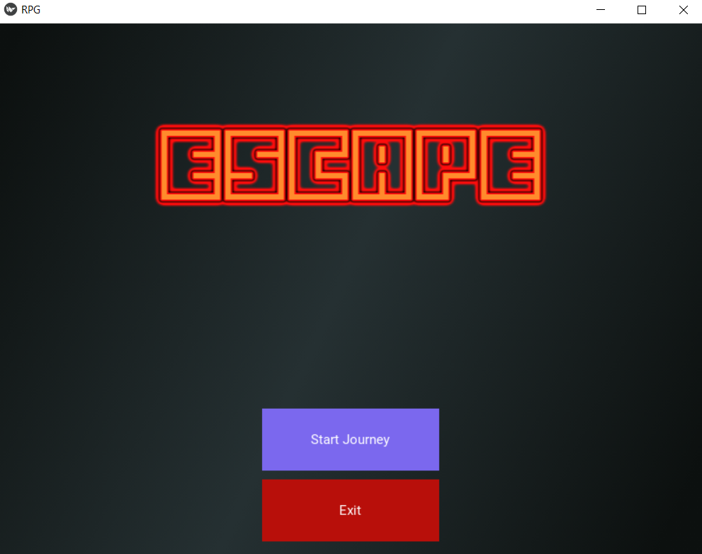

# Choose Your Own Adventure With Kivy

### A Choose Your Own Adventure Game using the python module Kivy

### How To Use It

* Install Python, Kivy, an IDE
* Run `main.py` 

### Dependencies

This project uses Kivy for the GUI. This project uses the Python language, also the Kivy language.

### Screenshots
Main Menu:

